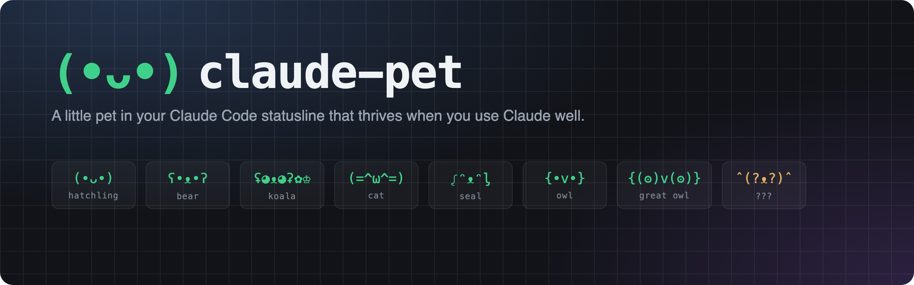
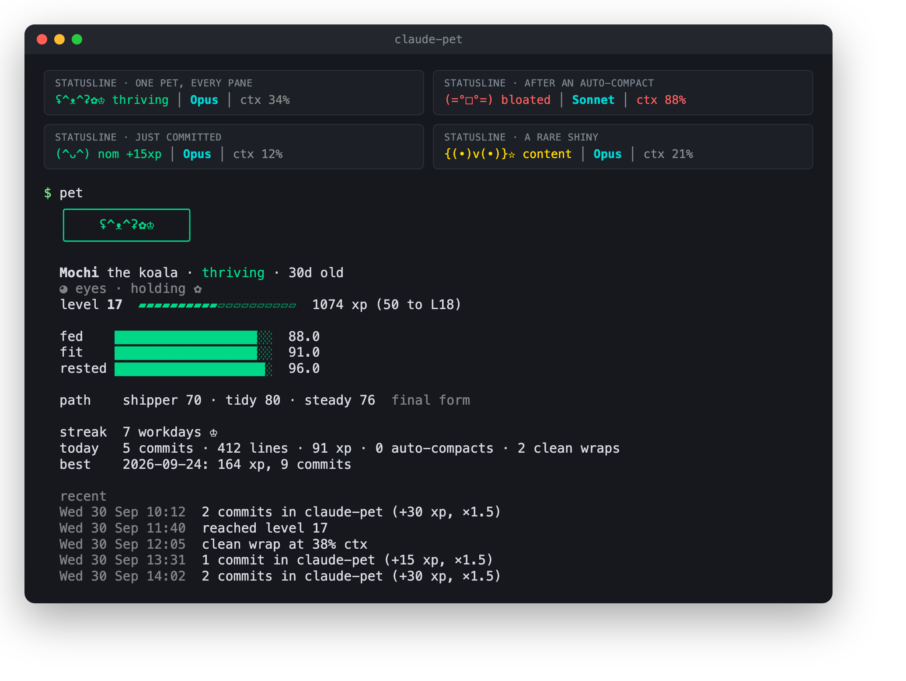

<p align="center"></p>

A little pet that lives in your Claude Code statusline. It does well when you use Claude well: shipping commits, keeping context lean, wrapping sessions cleanly, not redlining your rate limits. It sulks when neglected, and evolves into different creatures depending on how you work.

<p align="center"></p>

One pet is shared across every Claude session on the machine, so every pane shows the same face and the same animation frame. Everything is local: state lives in a JSON file, the only external command is a local `git log`, and nothing touches the network.

## Install

One binary, no runtime to install. The one-line scripts download the latest release, check its checksum and run setup for you:

```sh
curl -fsSL https://raw.githubusercontent.com/DanielAckroyd/claude-pet/main/install.sh | sh        # macOS / Linux
```
```powershell
irm https://raw.githubusercontent.com/DanielAckroyd/claude-pet/main/install.ps1 | iex             # Windows
```

With Go installed, `go install github.com/DanielAckroyd/claude-pet@latest` works too, or grab a binary from the [releases page](https://github.com/DanielAckroyd/claude-pet/releases).

If you installed without the script, wire it into Claude Code:

```sh
claude-pet setup
```

It asks **express** or **custom**:

- **Express:** sensible defaults, no questions. If you already have a statusline, the pet goes in front of it and your script stays untouched. Otherwise you get the bundled one (pet, model, context %). It also adds two hooks for scoring.
- **Custom:** a quick guide, then a few questions: work hours, where the pet goes, hooks, and a name.

It backs up `~/.claude/settings.json` before touching it, keeps everything else in there exactly as it was, and is safe to re-run. Start a new Claude Code session and your pet hatches. Any terminal works.

**With Claude Code:** paste this in.

> Install claude-pet by running `curl -fsSL https://raw.githubusercontent.com/DanielAckroyd/claude-pet/main/install.sh | sh` (on Windows, the install.ps1 line from https://github.com/DanielAckroyd/claude-pet), then run `claude-pet setup --express` and show me the output.

For a custom setup through Claude, ask it to pass the options as flags: `--hours 8-16`, `--statusline wrap|replace|skip`, `--no-hooks`, `--name NAME`. Add `--dry-run` to preview first.

**Uninstall:** `claude-pet setup --uninstall` puts your statusline and hooks back the way they were. Then delete the `claude-pet` binary (the install script puts it in `~/.local/bin`, or `%LOCALAPPDATA%\Programs\claude-pet` on Windows). Your pet stays in `~/.claude/pet` until you delete the folder.

<details>
<summary>Adding the pet inside your own statusline script</summary>

The express setup wraps your statusline, which costs about 10ms per render. If you'd rather build the pet into your own script, do that and run setup with `--statusline skip`. `--segment` prints only the pet:

```sh
input=$(cat)
pet=$(printf '%s' "$input" | claude-pet statusline --segment)
printf '%s │ %s' "$pet" "$(echo "$input" | jq -r .model.display_name)"
```

```python
pet = subprocess.run(["claude-pet", "statusline", "--segment"], input=json.dumps(data),
                     capture_output=True, text=True, timeout=1).stdout
```

Set `"refreshInterval": 5000` on your `statusLine` so it animates between messages. The statusline command never fails; if anything goes wrong the pet just doesn't show.

</details>

## How it scores

| Stat | Goes up | Goes down |
|---|---|---|
| **fed** | Commits (+15), lines changed | Slowly over work hours |
| **fit** | Clean wraps: ending a session that shipped something while context is under 70% | Auto-compacts (-20, and it's bloated for 30 min), working in a session above 80% context, coming back to a session after its prompt cache expired (-5 per 100k tokens re-cached, max -15) |
| **rested** | Tracks your 5h rate limit usage, full while you're under 50% | Falls as you approach 100% |
| **xp** | Commits (x1.5 if context is under 50%), lines changed | Only when it devolves |

Decay only counts work hours (Mon to Fri, 09:00 to 17:00 local by default), so evenings and weekends are free. Manual `/compact` is neutral. Stats floor at 5 and the pet never dies. A streak counts weekdays with at least one commit that ended with fit ≥ 50, and at 5+ days it gets a crown ♔.

Two warnings show only in the pane whose session triggered them, while every other pane keeps the shared mood: **chilly** `(°~°)` when that session's prompt cache is about to expire (send a message or wrap up), and **stuffed** `(•ε•)` when its context is over 70% or past 400k tokens. Neither changes stats; bloated and wilting still take priority.

Commits are counted from the repo you're working in, matched on that repo's `user.email`, so make sure it's set. Rate limit data only comes through on Claude subscription plans. On an API key, rested sits at a neutral 80 and the steady trait won't build.

## Evolution

The hatchling picks a species at L5 based on how you've worked over roughly the last 4 work hours, then a final form at L15 the same way. Final forms are locked.

```
(•ᴗ•) hatchling  (L1–4)
 ├─ shipper  ʕ•ᴥ•ʔ    bear      → seal ᶘ•ᴥ•ᶅ · koala ʢ•ᴥ•ʡ · dog U•ᴥ•U
 ├─ tidy     (=•ω•=)  cat       → tiger (≡•ω•≡) · neko /ᐠ•ꞈ•ᐟ\ · lynx /\•ω•/\
 ├─ steady   {•v•}    owl       → penguin <(•v•)> · dove ~(•v•)~ · great owl {(•)v(•)}
 └─ ???      ˆ(•ᴥ•)ˆ  fox       → wolf ᐡ•ᴥ•ᐡ · fennec ᐠ(•ᴥ•)ᐟ · kitsune ミᕱ•ᴥ•ᕱ彡
```

- **shipper:** committing regularly
- **tidy:** clean wraps, minus auto-compacts and cold caches
- **steady:** active time spent under 50% of your 5h limit
- The fox is the hidden one. You'll have to find it.

Each pet also rolls its own look when it hatches: eye style, a held charm (✿ ♡ ☆ ♣ ❀) and a 1 in 20 chance of being shiny, which shows as gold when it's happy.

**Devolving:** if fit and rested average under 30 for 90 minutes of active use, the pet wilts back a tier and loses a couple of levels. Its next evolution picks a branch fresh, so it might go a different way. Being away never devolves it. Only line or context changes count as activity, so a pane left open in a terminal multiplexer doesn't count as you being there. You can also do it on purpose with `claude-pet devolve`.

## Commands

```
claude-pet              stat sheet: face, level, stats, path, streak, today, recent events
claude-pet log [n]      recent events
claude-pet name NEW     rename
claude-pet tree         the evolution paths
claude-pet devolve      drop back a tier on purpose (asks first; -y skips the prompt)
claude-pet glyphs       every form × mood × frame, to check your terminal renders them evenly
claude-pet setup        wire it into Claude Code (or --custom, --uninstall)
```

It's a long name to type, so `alias pet=claude-pet` is worth adding. There's no reset command. Delete `~/.claude/pet/state.json` if you really mean it.

## Config

Put overrides in `~/.claude/pet/config.json`, which upgrades never touch. Any key from the tuning list in [`internal/pet/engine.go`](internal/pet/engine.go) works (`work_start`, `fed_per_commit`, `wilt_minutes` and so on), e.g. different work hours:

```json
{ "work_start": 8, "work_end": 16 }
```

Set `PET_DISABLE=1` to switch the pet off without uninstalling.

## Updating

Re-run the install script (or `go install github.com/DanielAckroyd/claude-pet@latest`). Your pet lives in `~/.claude/pet`, separate from the binary, so it carries over.

## Notes

- **Multiple panes:** they share state safely. Updates take a file lock, and a pane that can't get the lock renders read-only. Per-session baselines mean lines are never counted twice.
- **Commits:** read with `git log --branches`, at most once a minute per repo, matched exactly on `user.email`. Amends and rebases don't count twice.
- **Platforms:** macOS, Linux and Windows, on amd64 and arm64. File locking uses `flock` on macOS and Linux, and `LockFileEx` on Windows.
- **Tests:** `go test ./...`. They use a temp `PET_HOME` and `HOME`, so they never touch your real pet or settings.
